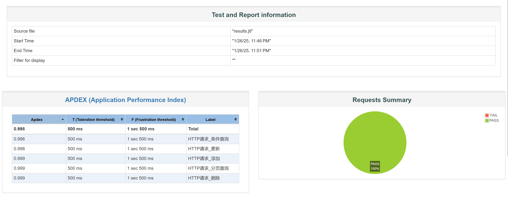
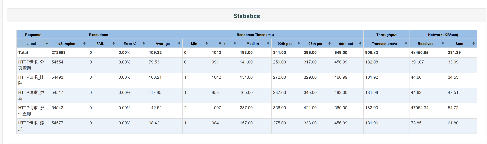

# Transaction-Management-System

## 系统简介
基于SpringBoot的简易单体银行交易流水管理系统。系统提供了创建交易、修改交易、删除交易、分页展示所有交易、根据条件过滤、根据ID查询等功能。

## 部署运行方式
### 本地springboot工程运行
* 确保已安装Java开发环境（JDK 21 及以上）
* 使用Maven构建工具进行项目编译和运行
```shell
   mvn clean install
   mvn spring-boot:run
```
### 容器化部署运行
* 使用Docker进行容器化部署
```shell

docker build -t transaction-management-system .
docker run -d -p 8080:8080 transaction-management-system

```
```dockerfile
FROM openjdk:21
LABEL authors="juspin"

COPY ./transaction-management-system-1.0.1-SNAPSHOT.jar /transaction-management-system-1.0.1-SNAPSHOT.jar

EXPOSE 8080

ENTRYPOINT ["java", "-jar", "transaction-management-system-1.0.1-SNAPSHOT.jar"]
```
### 功能演示(postman)

## 技术架构
* 基于springboot工程搭建
* 框架 Spring MVC + MyBatis
* 参数校验：Spring Validate
* 数据库：H2内存数据库
* 缓存：EhCache
* API设计：restful api
* 代码层次：Controller、Service、Repository
```html
src/main/java/com/juspin/task/
    ├── advice/
    │   └── ControllerAdvice.java
    ├── config/
    │   └── SwaggerConfig.java
    ├── controller/
    │   └── TransactionController.java
    ├── service/
    │   ├── ITransactionService.java
    │   └── TransactionService.java
    ├── repository/
    │   ├── dao/
    │   │   └── TransactionDao.java
    │   └── mapper/
    │       └── TransactionMapper.java
    └── TransactionApplication.java
```
### 关键设计
* 全局统一返回结果封装；
* 全局统一异常处理及异常日志打印；

* restful API设计+分层代码结构设计，设计符合开闭原则，可扩展、可维护性良好；
* 充分的参数校验，确保不可信域数据输入的安全性；
* 通过缓存加速查询，并通过代码设计保证数据一致性，避免脏读。

### API 接口详情
### 创建交易
* URL: POST /app/transaction/create
* 请求示例:
```json
{
  "owner": "juspin", //必传
  "fromAccount": "mycount", //必传
  "toAccount": "zhangsan", //必传
  "amount": 3888, //必传
  "type": "收入", //必传
  "category": "存款", //可选
  "remark": "转账给张三" //可选
}
```
### 修改交易
```
* URL: PUT /app/transaction/update/{id}?remark=[remark]&category=[category]
* 路径参数: id (必传)
* 查询参数: remark (可选), category (可选)
```
### 删除交易
```
* URL: DELETE /app/transaction/update/{id}
* 路径参数: id (必传)
```
### 查询交易
```
* URL: GET /app/transaction/{id}
* 路径参数: id (必传)
```
### 展示所有交易
```
* URL: GET /app/transaction/listAll?page=[page]&size=[size]
* 查询参数: page (必传), size (必传)
```
### 根据条件过滤查询
```
* URL: POST /app/transaction/filter
* 请求体示例:
```
```json
{
  "owner": "juspin",
  "type": "收入",
  "category": "存款",
  "minAmount": 4000,
  "maxAmount": 5000
}
```
## 开发者测试
### 单元测试(Junit+Mockito 100%方法和行覆盖)

### 功能测试
* case: 根据ID查询，存在记录

* case: 根据ID查询，不存在记录

* case: 根据ID修改，存在记录

* case: 根据ID修改，不存在记录

* case: 根据ID删除，存在记录

* case: 根据ID删除，不存在记录

* case: 根据条件过滤，符合条件

* case: 根据条件过滤，不符合条件

* case: 查询所有记录，首页

* case: 查询所有记录，中间页

* case: 查询所有记录，最后一页

* case: 参数校验失败

### 集成测试
* 长稳及压力测试
时间关系，只简单模拟并发场景(100个线程在3内拉起)




## 总结
* 本项目实现了简单的银行交易管理系统的核心功能；
* 时间关系，未进行前端设计开发，后续可持续迭代或集成swagger方便接口维护测试；
* 当前数据存储于内存，后续可考虑使用Sqlite持久化到磁盘；
* 当前未进行容器化改造，后续可迭代charts开发，通过helm打包部署到K8s集群运行。
  